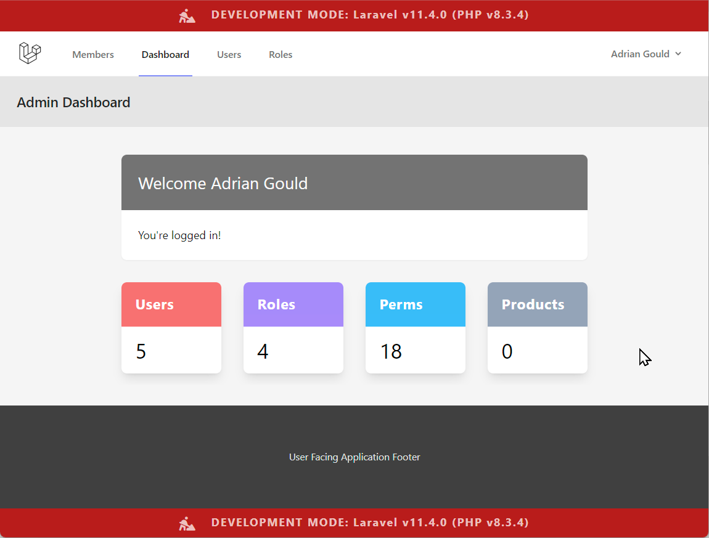

# Laravel Roles & Permissions

- using Spatie's Laravel Permissions Package
  <a name="readme-top"></a>

This demo application is based upon:

- Spatie Laravel Permission Documentation
- Role and Permission in Laravel 10

#### Built With

[![PHP][Php.com]][Php-url]
[![Laravel][Laravel.com]][Laravel-url]
[![Tailwindcss][Tailwindcss.com]][Tailwindcss-url]
[![Livewire][Livewire.com]][Livewire-url]
[![Inertia][Inertia.com]][Inertia-url]
[![SpatiePerms][SpatiePerms.com]][SpatiePermsUrl]

## Definitions

| Term       | Definition                                                                                                  |
|------------|-------------------------------------------------------------------------------------------------------------|
| BREAD      | Database operations to Browse, Read, Edit, Add and Delete data                                              |
| CRUD       | More commonly used term over BREAD. Create (Add), Retrieve (Browse/Read), Update (Edit) and Delete (Delete) |
| Role       | ...                                                                                                         |
| Permission | ...                                                                                                         |
| Gate       | ...                                                                                                         |
| Policy     | ...                                                                                                         |

<p align="right">(<a href="#readme-top">back to top</a>)</p>

## Description

This small demonstration application was developed to assist in the
learning of how to implement roles and permissions in Laravel.

It provides the ability to assign and revoke roles to users, uses these
roles to determine where/what a user may view, and also update the
navigation based on the user role(s).

<p align="right">(<a href="#readme-top">back to top</a>)</p>

## Table of Contents

TO DO: Add extra, or update the contents as needed, then remove this line.

- [Description](#description)
- [Definitions](#definitions)
- [Installation](#installation)
- [Usage](#usage)
- [Credits](#credits)
- [Licence](#licence)
- [Badges](#badges)
- [Features](#features)
- [Tests](#tests)
- [Contact](#contact)

## Installation

> All instructions will use the Bash CLI.

Before you start:

1) Update laragon's PHP - recommend at least 8.3.12
    - [Update PHP in Laragon](https://help.screencraft.net.au/hc/2680392001/83/update-php-in-laragon?category_id=29)
    - [Add a new version of PHP to Laragon?](https://help.screencraft.net.au/hc/2680392001/67/add-a-new-version-of-php-to-laragon?category_id=29)
2) Update laragon's Apache - recommend at least 2.4.59
    - [Update the Apache web server in Laragon](https://help.screencraft.net.au/hc/2680392001/68/update-the-apache-web-server-in-laragon?category_id=29)
3) Add Bash to the MS Terminal
    - [Add Git Bash to Microsoft Terminal](https://help.screencraft.net.au/hc/2680392001/65/add-git-bash-to-microsoft-terminal?category_id=35)
    - [Add or Update Bash Command Line Aliases for Git, Laravel, and more](https://help.screencraft.net.au/hc/2680392001/66/add-bash-command-line-aliases-for-git?category_id=35)
4) Add Mailpit
    - [Install and Run MailPit?](https://help.screencraft.net.au/hc/2680392001/69/install-and-run-mailpit?category_id=29)
5) Update NodeJS
    - [Update NodeJS (and NPM) in Laragon](https://help.screencraft.net.au/hc/2680392001/84/update-nodejs-and-npm-in-laragon?category_id=35)
6) Update the Laragon Web Root Folder
    - [Changing the Laragon Root Folder](https://help.screencraft.net.au/hc/2680392001/61/change-the-laragon-web-root-folder?category_id=29)
7) OPTIONAL - Add xDebug to PHP
    - [Add PHP and xDebug (Windows/Laragon)](https://help.screencraft.net.au/hc/2680392001/91/php-and-xdebug-windowslaragon?category_id=35)

### Working Folder

When at college we work in the C:\Users\USER_NAME\Source\Repos folder.

Open Bash CLI in MS Terminal, and execute:

```shell
cd /c/Users/USER_NAME
mkdir -p Source/Repos
```

If it complains about the folders existing, then do not panic. This means you had made them previously :)

### Ensure PHP Extensions are enabled:

The following extensions are required to be enabled:

- bz2
- curl
- fileinfo
- gd
- intl
- mbstring
- exif
- mysqli
- openssl
- pdo_mysql
- pdo_sqlite
- xsl
- zip

Use the Laragon UI to do this by:

- right mouse click on Laragon UI
- hover over PHP
- hover over the Extensions option
- click on any extension from the list above that is not ticked

### Clone this repository

Execute

```shell
git clone https://github.com/AdyGCoder/laravel-11-roles-permissions-demo.git
```

Once cloned:

```shell
cd laravel-11-roles-permissions-demo/
```

Copy the example environment file (we will use SQLite for the Database):

```shell
cp .env.sqlite .env
```

Create an SQLite database file:

```shell
touch database/database.sqlite
```

Install the PHP Packages used by this app:

```shell
run composer install
```

Install the NodeJS Modules used by this app:\

```shell
run npm install
```

Generate a new App key

```shell
php artisan key:generate
```

Migrate the databases and seed the data

```shell
php artisan migrate:fresh --seed
```

### Run background processes

Split your terminal using `ALT`+`SHIFT`+`-` (split horizontally)

Click in bottom part of window and execute:

```shell
cd laravel-11-roles-permissions-demo
npm run dev
```

Split this "npm" part of the terminal window vertically using `ALT`+`SHIFT`+`+`.

Then use the following to execute MailPit:

```shell
cd laravel-11-roles-permissions-demo
mailpit --smtp 0.0.0.0:2525
```

Split this "MailPit" part of the terminal window vertically using `ALT`+`SHIFT`+`+`.

Then use the following to execute the Queue service from Laravel:

```shell
cd laravel-11-roles-permissions-demo
php artisan queue:listen --verbose
```

### Visit Application

Head to [http://laravel-11-roles-permissions-demo.test]

### Test Users

| Username                 | Password  | Role        |
|--------------------------|-----------|-------------|
| admin@example.com        | Password1 | Super Admin |
| adrian.gould@example.com | Password1 | Super Admin |
| STUDENT.NAME@example.com | Password1 | Admin       |
| cat.atonic@example.com   | Password1 | Member      |
| dee.mouser@example.com   | Password1 | Guest       |

<p align="right">(<a href="#readme-top">back to top</a>)</p>

## Usage

> Add details of how to use this demonstration application




<p align="right">(<a href="#readme-top">back to top</a>)</p>

## Credits

- Laravel Permission. (n.d.) Spatie.com. https://spatie.be/docs/laravel-permission/v6/introduction
- Role And Permission In Laravel 10 using Spatie: The Definitive Guide.
  (2023)
  Medium.com https://medium.com/@prevailexcellent/role-and-permission-in-laravel-10-using-spatie-the-definitive-guide-2023-57bb6b56abcd

### General Credits

- Font Awesome. (n.d.). Fontawesome.com. https://fontawesome.com
- Laravel - The PHP Framework For Web Artisans. (2011). Laravel.com. https://laravel.com
- PHP: Hypertext Preprocessor. (n.d.). Www.php.net. https://php.net
- TailwindCSS. (2023). Tailwind CSS - Rapidly build modern websites
  without ever leaving your HTML. Tailwindcss.com. https://tailwindcss.com/

<p align="right">(<a href="#readme-top">back to top</a>)</p>

## Badges

[![Forks][forks-shield]][forks-url]
[![Downloads][downloads-shield]][downloads-url]

[![Languages][languages-shield]][languages-url]
[![Issues][issues-shield]][issues-url]

[![Educational Community Licence][licence-shield]][licence-url]


<p align="right">(<a href="#readme-top">back to top</a>)</p>

## Features

- Login, Register, Logout
    - Out of the box Laravel Breeze using Sanctum
- Guest, Member, Admin & Super-Admin Roles
    - Implemented using Spatie Permissions
- Member Dashboard
    - Just a welcome dashboard
- Admin Dashboard
    - includes a simple set of 'cards' with counts of users, roles et al.

> More features may be added in the future

<p align="right">(<a href="#readme-top">back to top</a>)</p>

## Tests

> Tests to be developed


<p align="right">(<a href="#readme-top">back to top</a>)</p>

## Contact

Adrian Gould - Adrian.Gould@nmtafe.wa.edu.au

Project Link: https://github.com/AdyGCode/laravel-11-roles-permissions-demo

<p align="right">(<a href="#readme-top">back to top</a>)</p>

## Licence

Please see the [Educational Community License](License.md) for more details.

Any code based upon this project must also give the appropriate credit
both in the source code and also on nay associated promotional, educational,
corporate or other materials both digital and non-digital.


<p align="right">(<a href="#readme-top">back to top</a>)</p>


<!-- MARKDOWN LINKS & IMAGES -->
<!-- https://www.markdownguide.org/basic-syntax/#reference-style-links -->

[forks-shield]: http://img.shields.io/github/forks/adygcode/laravel-11-roles-permissions-demo.svg?style=for-the-badge

[forks-url]: https://github.com/AdyGCode/laravel-11-roles-permissions-demo/network/members

[languages-shield]: http://img.shields.io/github/languages/count/adygcode/laravel-11-roles-permissions-demo.svg?style=for-the-badge

[languages-url]: https://github.com/AdyGCode/laravel-11-roles-permissions-demo/network/members

[downloads-shield]: http://img.shields.io/github/downloads/adygcode/laravel-11-roles-permissions-demo/total?style=for-the-badge

[downloads-url]: https://github.com/AdyGCode/laravel-11-roles-permissions-demo/network/members

[issues-shield]: http://img.shields.io/github/issues/adygcode/laravel-11-roles-permissions-demo.svg?style=for-the-badge

[issues-url]: https://github.com/adygcode/laravel-11-roles-permissions-demo/issues

[licence-shield]: https://img.shields.io/badge/opensourceinitiative-3DA639?style=for-the-badge

[licence-url]: https://github.com/adygcode/laravel-11-roles-permissions-demo/blob/main/License.md

[product-screenshot]: images/screenshot.png

[Laravel.com]: https://img.shields.io/badge/Laravel-FF2D20?style=for-the-badge&logo=laravel&logoColor=white

[Laravel-url]: https://laravel.com

[Tailwindcss.com]: https://img.shields.io/badge/Tailwindcss-06B6D4?style=for-the-badge&logo=tailwindcss&logoColor=white

[Tailwindcss-url]: https://tailwindcss.com

[Livewire.com]: https://img.shields.io/badge/Livewire-4E56A6?style=for-the-badge&logo=livewire&logoColor=white

[Livewire-url]: https://livewire.laravel.com

[Inertia.com]: https://img.shields.io/badge/Inertia-9553E9?style=for-the-badge&logo=inertia&logoColor=white

[Inertia-url]: https://inertiajs.com

[Php.com]: https://img.shields.io/badge/Php-777BB4?style=for-the-badge&logo=php&logoColor=white

[Php-url]: https://inertiajs.com

[SpatiePerms.com]: https://img.shields.io/badge/Spatie-777BB4?style=for-the-badge&logo=php&logoColor=white

[SpatiePermsUrl]: https://github.com/spatie/laravel-permission
